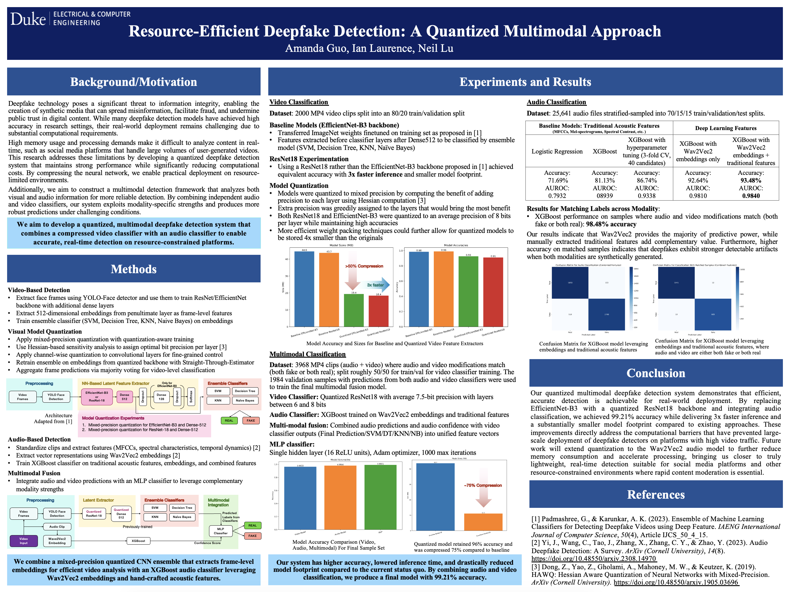

# Resource-Efficient Deepfake Detection: A Quantized Multimodal Approach

> We aim to develop a quantized, multimodal deepfake detection system that combines a compressed video classifier with an audio classifier to enable accurate, real-time detection on resource-constrained platforms.

## The Notebooks 

We have attached all the notebooks that were used for this project. 

- [`notebooks/1-basic-model-training.ipynb`](notebooks/1-basic-model-training.ipynb)
    - **Part A**: Replicating the Original Paper
    - **Part B**: Experiment 0: Quantize Only the Dense 512 Layer
    - **Part C**: Replacing EfficientNet with ResNet with the DeepFake Dataset 
    - **Part D**: Replacing EfficientNet with ResNet with the LAV-DF Dataset 
- [`notebooks/2-quantization-efficientnet.ipynb`](notebooks/2-quantization-efficientnet.ipynb)
    - **Part E**: Quantization for EfficientNet using the DeepFake Dataset
- [`notebooks/3-quantization-resnet.ipynb`](notebooks/3-quantization-resnet.ipynb)
    - **Part F**: Quantization for ResNet using the LAV-DF Dataset
- [`notebooks/4-audio-classifier.ipynb`](notebooks/4-audio-classifier.ipynb)
    - **Part G**: Audio Classifier for the LAV-DF Dataset
- [`notebooks/5-multimodal-classifier.ipynb`](notebooks/5-multimodal-classifier.ipynb)
    - **Part H**: Multimodal Classifier for the LAV-DF Dataset

## The Poster

